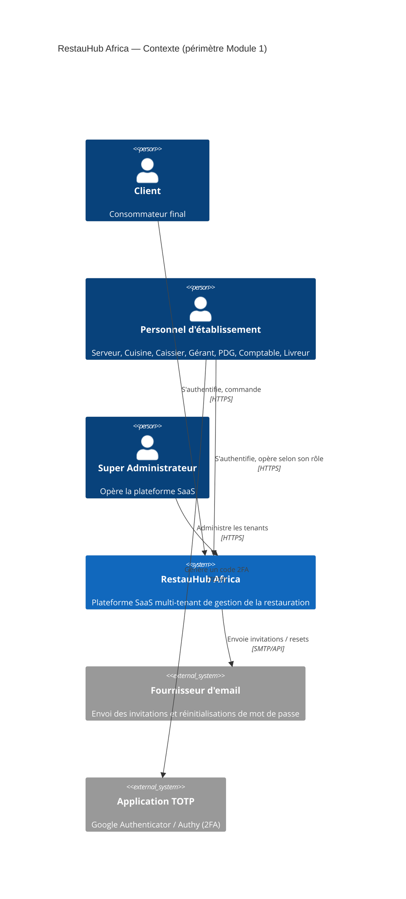
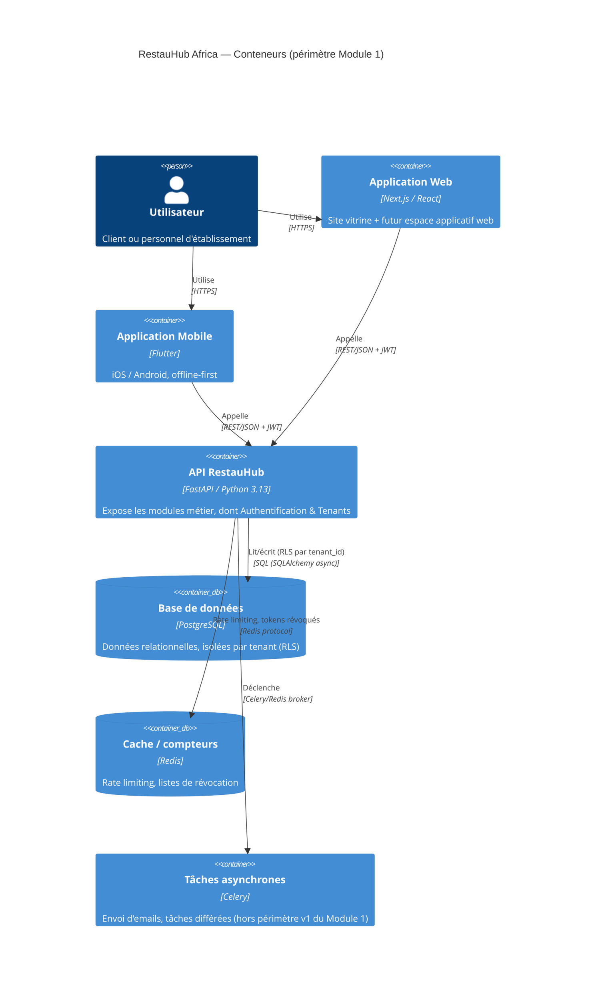
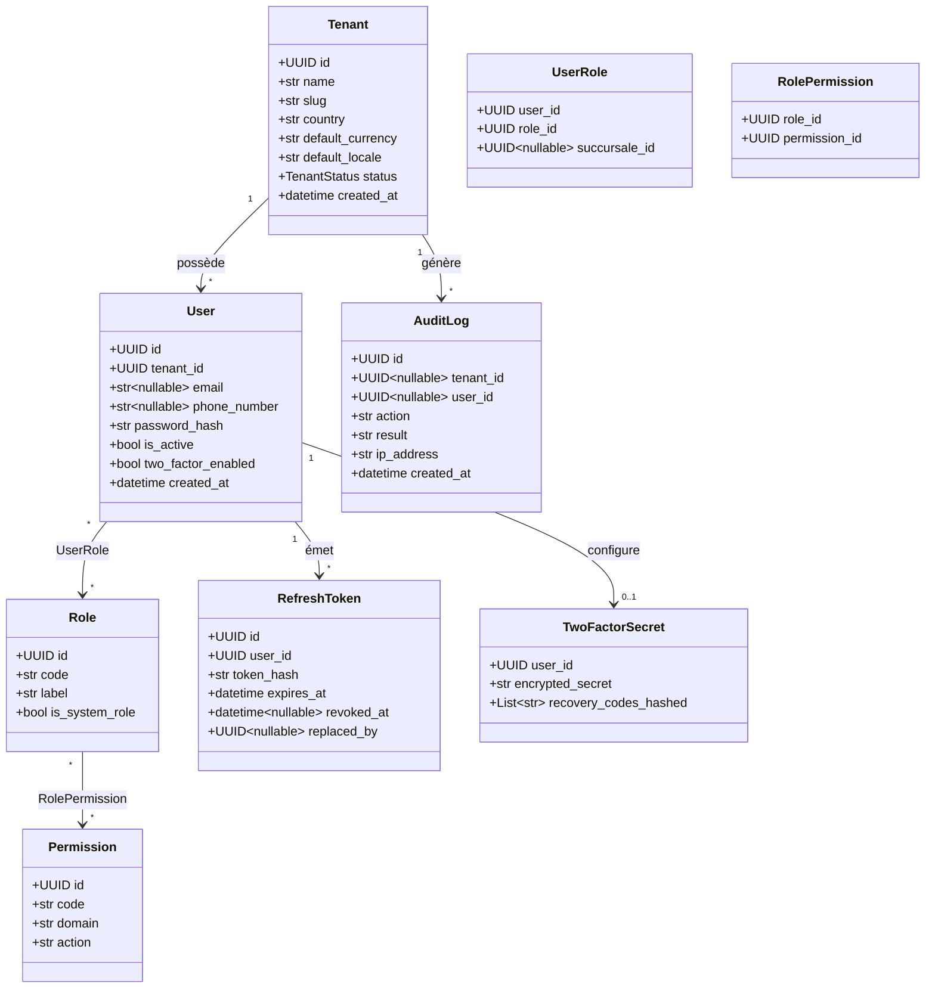
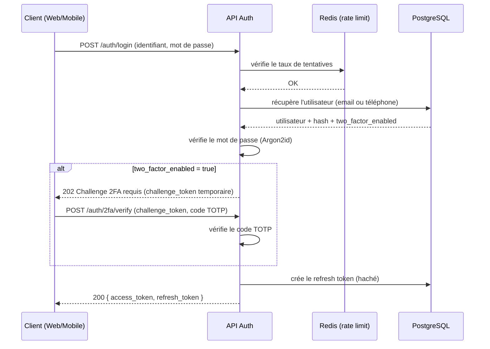

# 4. Diagrammes — Authentification & gestion des tenants

## 4.1 C4 — Niveau Contexte

## 4.2 C4 — Niveau Conteneurs

## 4.3 UML — Diagramme de classes du domaine

## 4.4 Séquence — Connexion avec 2FA

