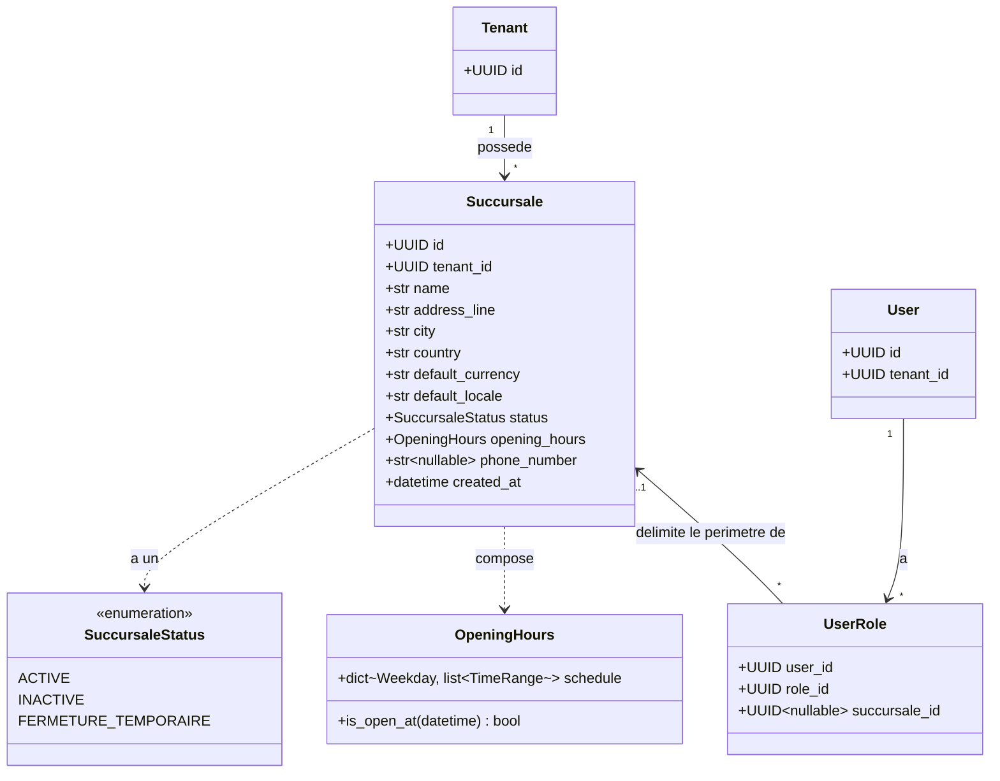
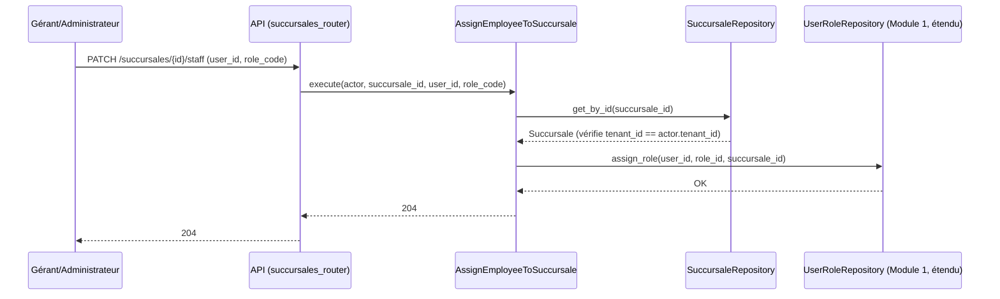
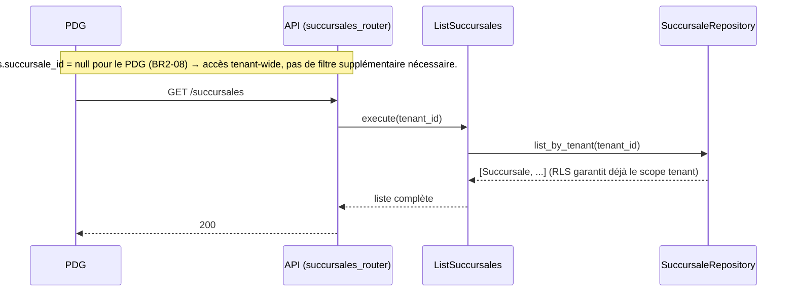

# 4. Diagrammes — Restaurants & succursales

## 4.1 C4 — Contexte et conteneurs

Inchangés par rapport au Module 1 (voir [../01-auth-tenants/04-diagrammes.md](../01-auth-tenants/04-diagrammes.md#41-c4--niveau-contexte)) : ce module n'introduit ni nouvel acteur, ni nouveau conteneur, ni système externe. Il ajoute uniquement des tables et des routes au conteneur API déjà existant.

## 4.2 UML — Diagramme de classes du domaine

## 4.3 Séquence — Rattachement d'un employé à une succursale

## 4.4 Séquence — Vue PDG multi-succursales

