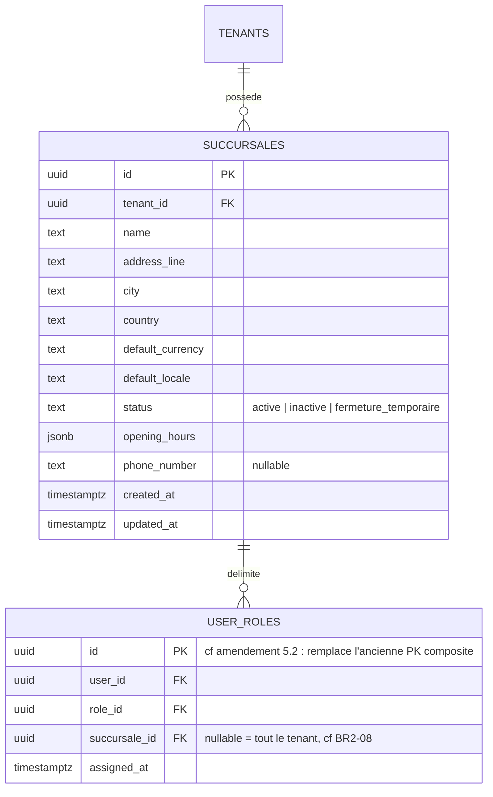

# 5. Modèle de données — Restaurants & succursales

## 5.1 Diagramme entité-relation



## 5.2 Amendement au schéma du Module 1 (découvert en concevant ce module)

La colonne `user_roles.succursale_id` avait été ajoutée par anticipation au Module 1, avec la note « n'est ni lue ni écrite par le Module 1 ». En la rendant active ici, un problème de conception apparaît : la clé primaire composite `(user_id, role_id)` du Module 1 empêche BR2-10 (« un même utilisateur peut être rattaché à plusieurs succursales avec le **même rôle** ») — deux lignes `(user_id=X, role_id=Y, succursale_id=A)` et `(user_id=X, role_id=Y, succursale_id=B)` entreraient en conflit de clé primaire alors qu'elles doivent pouvoir coexister.

**Correctif** (appliqué par la migration du Module 2, `user_roles` restant une table dont le Module 1 est propriétaire) :
- `user_roles` gagne une clé primaire de substitution `id` (UUID), remplaçant la clé composite `(user_id, role_id)`.
- Deux index uniques partiels remplacent l'ancienne contrainte, pour préserver l'intention initiale sans les défauts d'une contrainte UNIQUE classique sur une colonne nullable (PostgreSQL traite chaque `NULL` comme distinct dans une contrainte UNIQUE, ce qui autoriserait des doublons de rattachement tenant-wide sans cette précaution) :
  ```sql
  CREATE UNIQUE INDEX uq_user_roles_tenant_wide
      ON user_roles (user_id, role_id) WHERE succursale_id IS NULL;
  CREATE UNIQUE INDEX uq_user_roles_par_succursale
      ON user_roles (user_id, role_id, succursale_id) WHERE succursale_id IS NOT NULL;
  ```
- `user_roles.succursale_id` reçoit enfin sa contrainte de clé étrangère vers `succursales.id` (impossible avant, la table n'existait pas).

Ce correctif est mineur et rétrocompatible avec les données déjà en base (aucun tenant réel en production à ce stade du projet).

## 5.3 Notes de conception

**`succursales`** — `tenant_id` obligatoire (contrairement à `users.tenant_id`, aucune succursale n'est jamais transverse). `default_currency`/`default_locale` permettent à une succursale de différer du défaut du tenant (BR2-02, opération multi-pays sous un même tenant). `opening_hours` en JSONB plutôt qu'une table séparée : structure simple (créneaux par jour), pas de besoin de requêtage relationnel dessus, évite une table `succursale_opening_hours` pour un gain marginal.

**`user_roles`** — Voir amendement 5.2. Le passage à une clé de substitution est aussi l'occasion, pour les modules futurs, d'ajouter d'autres colonnes de portée (ex. un jour une portée par table/zone) sans nouvelle refonte de clé primaire.

## 5.4 Row-Level Security

`succursales` suit exactement le même schéma que les autres tables tenant-scopées du Module 1, **sans** le contexte `app.auth_lookup` (aucun cas d'usage pré-authentification dans ce module, voir [03-architecture.md](./03-architecture.md#34-isolation-multi-tenant)) :

```sql
ALTER TABLE succursales ENABLE ROW LEVEL SECURITY;
ALTER TABLE succursales FORCE ROW LEVEL SECURITY;
CREATE POLICY tenant_isolation ON succursales
    USING (
        tenant_id = NULLIF(current_setting('app.tenant_id', true), '')::uuid
        OR current_setting('app.is_super_admin', true) = 'true'
    );
```
